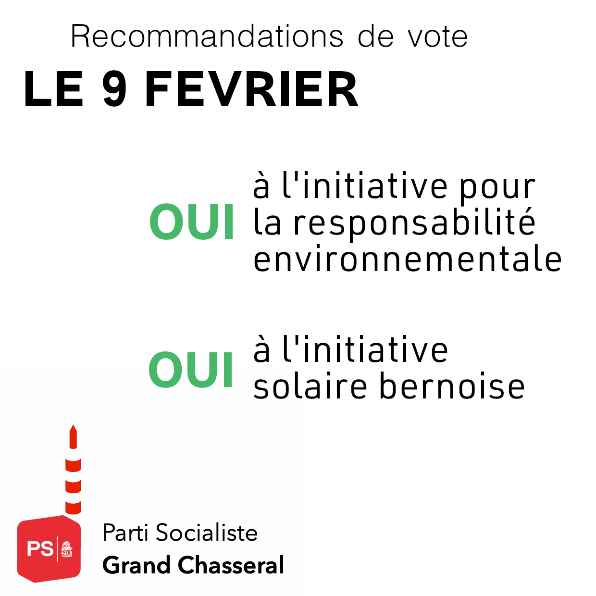

# Les recommandations de vote du PSGC pour les votations du 9 février

## OUI à l'initiative pour la responsabilité environnementale
Sans planète viable: pas d'humain. Sans humain: pas d'économie! 
L'initiative propose de reconnaître et prendre en compte la nature et sa capacité de renouvellement en tant que limite à l'économie nationale. C'est n'est rien d'autre que d'avoir une vision à long terme pour l'économie. Encore mieux, pour la mise en œuvre, elle implique la prise en compte de l'acceptabilité sociale des mesures. 

Notre économie dépasse actuellement largement les limites. Cette initiative est une véritable opportunité, pour l'humain et l'économie, qui a intérêt à continuer d'avoir de l'eau potable, un air pur et des aliments sains. 

Le PSGC recommande le OUI à cette initiative qui veut une transition économique, écologique et sociale urgente pour l'humanité.

## Oui à l'initiative solaire bernoise
Le PSGC soutient l'initiative visant à accroître l'utilisation de l'énergie solaire. Elle propose une bonne mesure pour la transition énergétique avec une meilleure exploitation du potentiel que représentent les toits et façades. 

Avec l'initiative, les nouvelles constructions présentant des toitures et façades qui s'y prêtent devront être équipées de systèmes d'utilisation de l'énergie solaire. Les constructions existantes seront concernées lorsqu'elles subissent une rénovation complète, au plus tard d'ici 2040. 

Avec d'autres stratégies énergétiques durables, il s'agit d'un pas dans la bonne direction. 

Les prises de positions au format PDF peuvent être téléchargées <a
      href='/docs/communications/2025_01_13_Recommandations_votations9fev_PSGC.pdf'
      target='_blank'
      class='text-blue'>ici</a>.

