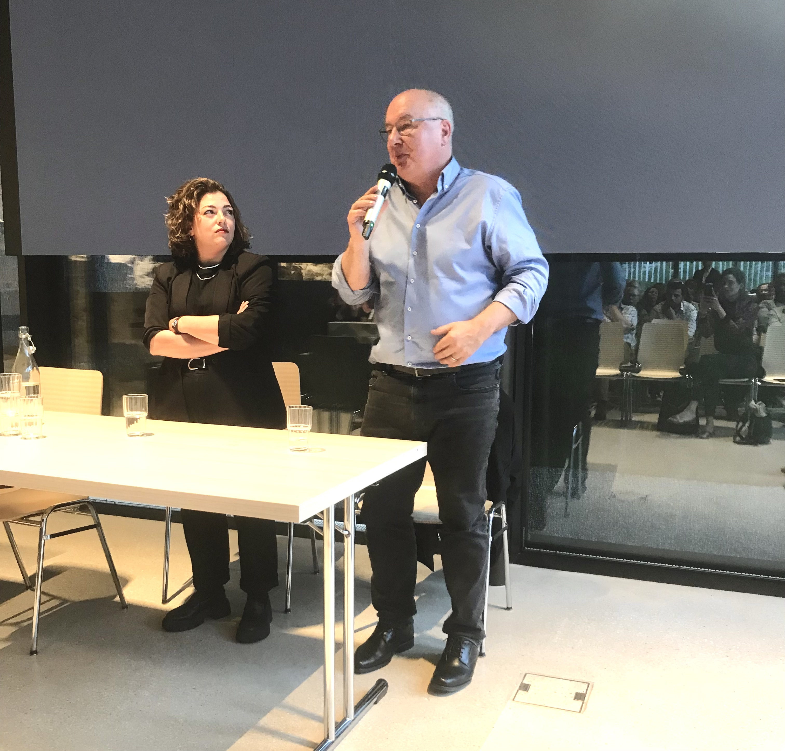

La salle de conférence de la Couronne était comble pour entendre Tamara Funiciello et Pierre-Yves Maillard parler des batailles politiques pour nos retraites. Inégalités face à la retraite et rétrospective historique ont captivés les esprits pour une soirée d'échange plus que réussie.

# Un public nombreux et des interventions de qualité 

Le jeudi 15 mai 2025, le Parti Socialiste Grand Chasseral a organisé un événement public avec la présence de la Conseillère nationale bernoise Tamara Funiciello et du Conseiller aux Etats Pierre-Yves Maillard. La soirée était axée sur le thème des retraites et les batailles politiques qui y sont liées. La salle de la Couronne à Sonceboz était remplie, une centaine de personnes, toutes générations confondues, sont venues écouter l'oratrice et l'orateur de la soirée. Après les salutations du co-président du PSGC Jérôme Benoit, qui a assuré la modération de la soirée, Maurane Riesen, également co-présidente, a tenu un <a
      href='/docs/communications/autres/discours_bienvenue_riesenm.pdf'
      target='_blank'
      class='text-blue'>discours</a> de bienvenue engagé. Place ensuite aux deux protagonistes de la soirée Tamara Funiciello et Pierre-Yves Maillard.

# Les inégalités face à la retraite

Tamara Funiciello a brillamment  <a
      href='/docs/communications/autres/Présentation_Funiciello_PSGC.pdf'
      target='_blank'
      class='text-blue'>présenté</a> des chiffres marquants montrant clairement que nous ne sommes pas tous égaux devant la retraite. Les différences de revenus à la retraite entre hommes et femmes (environ - 30\%), le nombre de personnes âgées vivant en-dessous du seuil de pauvreté (20\%), le nombre d'ayant droits aux prestations complémentaires qui ne les demandent pas (230'000 personnes), les différences dans les années d'espérance de vie en fonction du statut socio-économique (environ 7 ans), les différences de salaires cumulées sur une vie entre hommes et femmes (- 43\%). Tout cela montre qu'on peut et surtout qu'on doit faire mieux ! Le préambule de la Constitution, qui affirme que "... la force de la communauté se mesure au bien-être du plus faible de ses membres", nous oblige à améliorer la situation.

# Retrospective et perspective de la politique des retraites

Pierre-Yves Maillard a ensuite emporté les esprits avec un discours captivant sur les origines de l'AVS et de notre système de prévoyance dans les années 1940. Cette rétrospective a démontré que c'est la volonté politique et non le contexte économique qui a permis la création de l'AVS. Que la question des retraites et de la sécurité sociale était une question de démocratie qui devait apporter des réponses aux besoins urgents et vitaux de la population : comment survivre si l'on est trop vieux pour travailler, comment nourrir ses enfants si on perd son travail. Lorsque la démocratie n'arrive pas à répondre à ces besoins, les réponses simplistes (mais archi-fausses) des régimes totalitaires et autoritaires contaminent l'opinion publique et représentent un danger extrême. C'est donc dans une Europe affaiblie par la Seconde Guerre mondiale que les Etats, dont la Suisse, ont introduit ces sécurités. Pas parce qu'ils avaient de l'argent à dépenser, mais précisément pour protéger la démocratie. Il a ensuite montré que les perspectives catastrophistes de la droite sur la situation de l'AVS étaient totalement infondées et que l'AVS était un investissement extrêmement rentable, pour les sociétés mais aussi pour les individus.

# Une soirée d'échange réussie

Un riche échange avec le public a suivi, également empreint d'émotions. Après le mot de la fin de Gilles Marchand, président du PS Tavannes foule et intervenant-e-s ont pu continuer la discussion autour du verre de l'amitié. Cette soirée a été un grand succès pour le PSGC. Il a rappelé pour qui et pour quoi le Parti socialiste s'engage : pour les gens normaux, pour une vie digne dans l'âge, pour le respect, pour la démocratie!

Le communiqué de presse au format PDF peut être téléchargé <a
      href='/docs/communications/2025_05_16_Communiqué_du_PSGC.pdf'
      target='_blank'
      class='text-blue'>ici</a>.

Voir <a
      href='https://ajour.ch/fr/story/595191/quand-vivre-dignement-devient-un-combat-plaidoyer-de-deux-figures-de-la-gauche-helvtique'
      target='_blank'
      class='text-blue'>l'article</a> paru dans le média Ajour avec le titre: " <b>
Quand vivre dignement devient un combat: plaidoyer de deux figures de la gauche helvétique </b> - Alors que les retraites préoccupent une bonne partie de la population, deux voix fortes de la gauche, Tamara Funiciello et Pierre-Yves Maillard, ont rappelé que la dignité ne se négocie pas." (Ajour, le 16.05.2025, par Céline Latscha)

Pour rappel, voici le <a
      href='/docs/communications/PS_Flyer_A5_15mai.pdf'
      target='_blank'
      class='text-blue'>flyer</a> de la soirée au format PDF.

