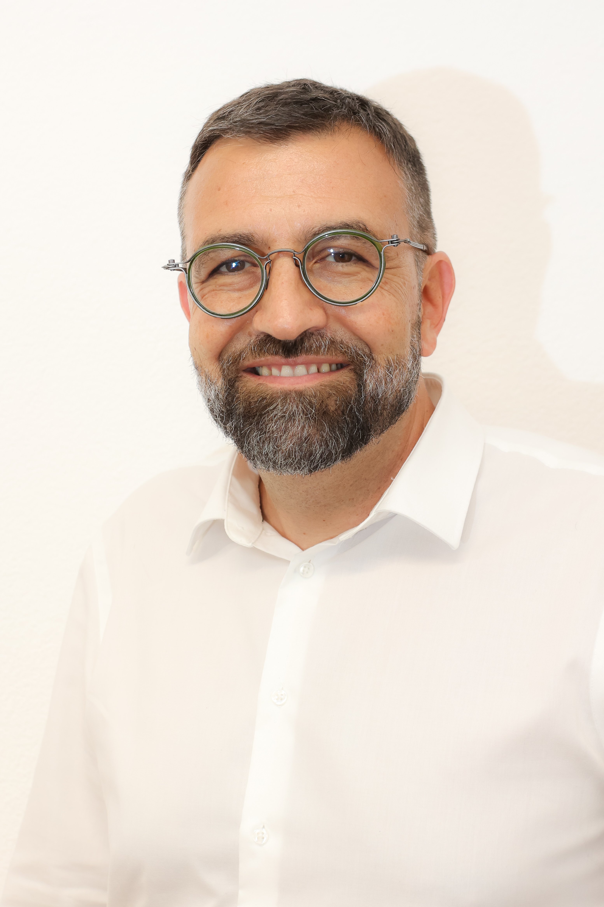

<b> Le 13 juin s'est tenu le Congrès du Parti Socialiste Grand Chasseral (PSGC). L'assemblée a nommé à l'unanimité Hervé Gullotti comme candidat pour les élections à l'exécutif cantonal. Pour le PSGC, sa grande expérience et sa vision à long terme pour le canton et la région en font le candidat idéal. Cette candidature sera soumise à la primaire régionale de gauche entre Vert-e-s et PS début août. </b>

# Un candidat fort pour regagner le siège du Jura bernois

Le PSGC présente Hervé Gullotti à l'attention de la primaire de la gauche régionale avec les Vert-e-s. Il est fier de pouvoir proposer une personnes avec autant d'expérience politique et de qualité comme candidat pour le siège de l'exécutif réservé au Jura bernois. Le tramelot de 52 ans a siégé au Grand Conseil entre 2017 et 2024 et a présidé l'institution en 2021/2022.  Depuis 2022 il est le maire de la commune de Tramelan. Hervé se distingue par sa capacité d'écoute, un solide réseau et une vision à long terme pour le canton et sa population. L'ensemble du PSGG est derrière sa candidature et espère que les Vert-e-s pourront aussi se rallier à cette candidature.

Comme indiqué dans la <a
      href='https://ps-gc.ch/docs/communications/2025_05_05_CP_commun_Gauche_GrandChasseral_VF_v2.pdf'
      target='_blank'
      class='text-blue'>communication commune</a> du 5 mai 2025, le PSGC et les Vert-e-s Grand Chasseral déterminent ensemble la candidature du Jura bernois qui sera proposée aux Congrès de leur partis cantonaux respectif fin août. Une primaire de la gauche régionale sera organisée début août, sauf en cas de retrait d'une candidature en faveur de l'autre. 

# Préparation de la campagne

Le PSGC se prépare aussi pour les élections au Grand Conseil et au Conseil du Jura bernois de mars 2026. Il prévoit de présenter deux listes, PS Femmes et PS Hommes avec  12 femmes et 12 hommes pour le Grand Conseil et le Conseil du Jura bernois. La nomination des candidatures se fera lors du deuxième congrès de l'année cet automne.

# Un accord avec le PSA-Moutier

Les élu-e-s du PSA-Moutier devront quitter leurs fonctions au Grand Conseil et au Conseil du Jura bernois avant 2026. Afin de garder ces sièges en main socialistes le PSGC va envoyer au PSA-Moutier la liste des candidat-e-s pour mars 2026. L'idée est que le PSA-Moutier puisse, si possible, nommer une personne qui sera candidate en 2026 pour remplacer les deux sièges laissés vacants au Conseil du Jura bernois et le siège laissé au Grand Conseil. Ces démissions et remplacements sont prévus cet automne.

Le communiqué de presse au format PDF peut être téléchargé <a
      href='/docs/communications/2025_06_13_Communiqué_du_PSGC.pdf'
      target='_blank'
      class='text-blue'>ici</a>.

