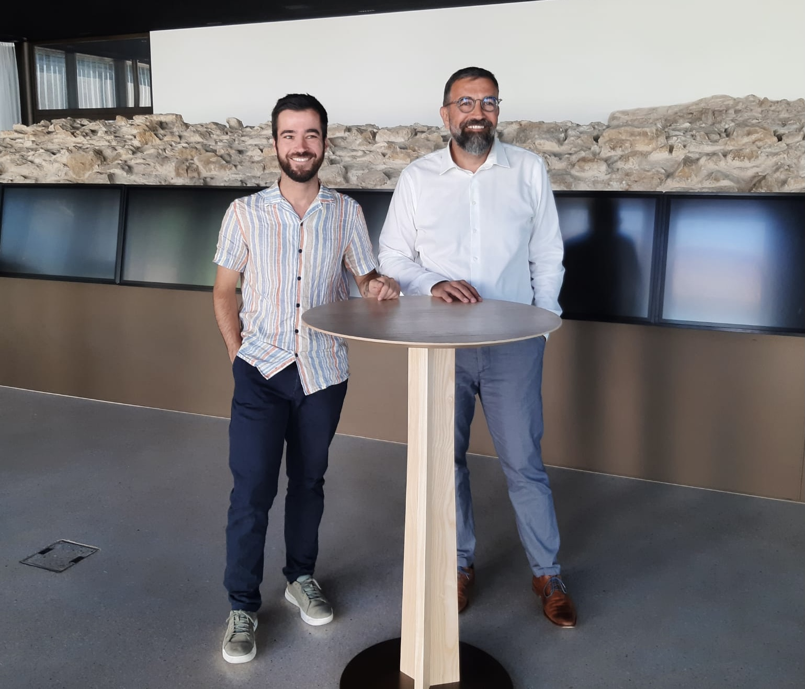
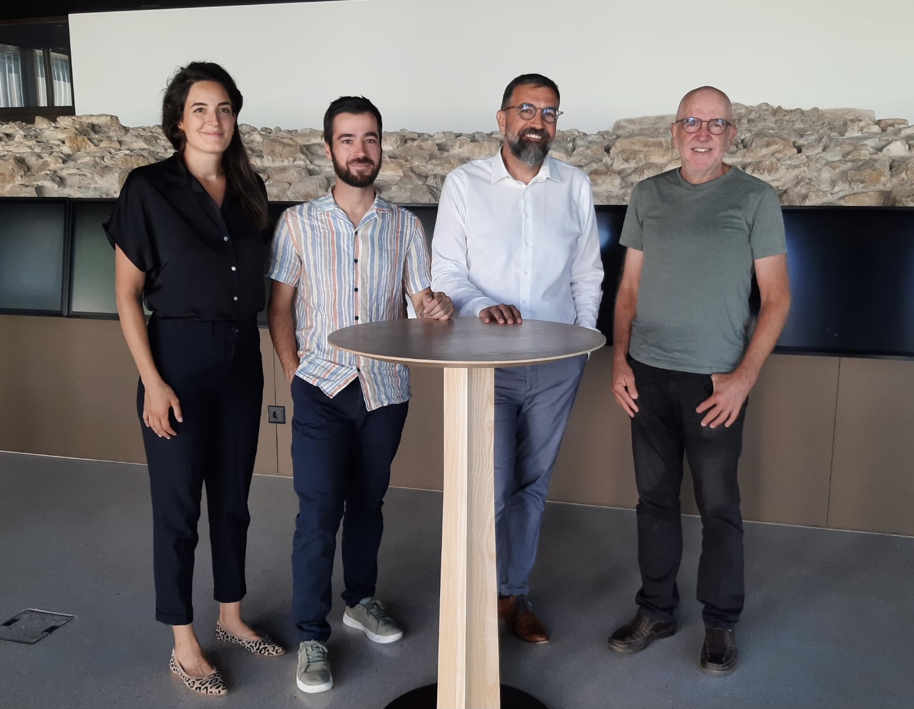

# La gauche du Grand Chasseral nomme Hervé Gullotti pour l’élection au Conseil-exécutif

<b> Les VERT-E-S et le PS du Grand Chasseral proposent la candidature de Hervé Gullotti pour le siège réservé au Jura bernois du Conseil-exécutif bernois. Cette décision fait suite à un consensus trouvé entre les deux partis régionaux et au retrait de la candidature de Cyprien Louis. </b>

Après des semaines de discussions constructives et de concertation, les directions régionales des VERT-E-S et du PS du Grand Chasseral annoncent la désignation d’Hervé Gullotti comme candidat officiel pour représenter le Jura bernois au sein du Conseil-exécutif bernois. Cette décision intervient après un consensus entre les directions des deux partis, unis dans la volonté de proposer une candidature forte et fédératrice pour les élections cantonales de 2026.

Hervé Gullotti, personnalité forte de la scène politique régionale et cantonale, a su démontrer à la fois ses compétences et son implication dans des projets de développement durable et de solidarité, des valeurs essentielles portées par les deux partis. "Je suis très honoré de cette nomination et fermement prêt à relever le défi au nom d'une gauche unie et déterminée.

L’avenir du canton doit être fondé sur l'émergence d'une société davantage solidaire et soucieuse de la défense de l'environnement", déclare l'actuel Maire de Tramelan et ancien Président du Grand Conseil Hervé Gullotti.
Cette désignation survient suite au retrait de la candidature de Cyprien Louis, un geste salué par les partis qui permettra de rassembler toutes les forces progressistes lors de la campagne à venir. "Ma décision de soutenir Hervé Gullotti permet à la gauche du Grand Chasseral de se présenter unie et prête à relever les défis du canton avec une vision cohérente et ambitieuse pour l’avenir. J'estime que Hervé et son expérience sont les cartes qui nous permettront de récupérer la majorité au sein de l'exécutif", explique le coprésident des VERT-E-S du canton de Berne. 

## Approbation par les délégué-es cantonaux le 27 août 

La désignation de Hervé Gullotti comme candidat unique pour la place réservé au Jura bernois au sein du ticket rose-vert cantonal sera encore validée par les Assemblées des délégué-es des deux partis cantonaux. Ces dernières auront lieu simultanément le mercredi 27 août prochain, à Bienne pour les VERT-E-S et à Berne pour le PS. Avec la nomination d'Hervé Gullotti et du choix des membres des VERT-E-S entre Lena Frank, Aline Trede et Beat Kohler pour accompagner les candidatures déjà validées de Evi Allemann et Reto Müller, le ticket à quatre sera alors complet et définitif.  

Le communiqué de presse commun du PSGC et des Vert-e-s GC au format PDF peut être téléchargé ici en <a
      href='/docs/communications/CP_ConseilExecutif_Jurabernois_20250811_FR.pdf'
      target='_blank'
      class='text-blue'>français</a> ou en <a
      href='/docs/communications/CP_ConseilExecutif_Jurabernois_20250811_DE.pdf'
      target='_blank'
      class='text-blue'>allemand</a>  .

