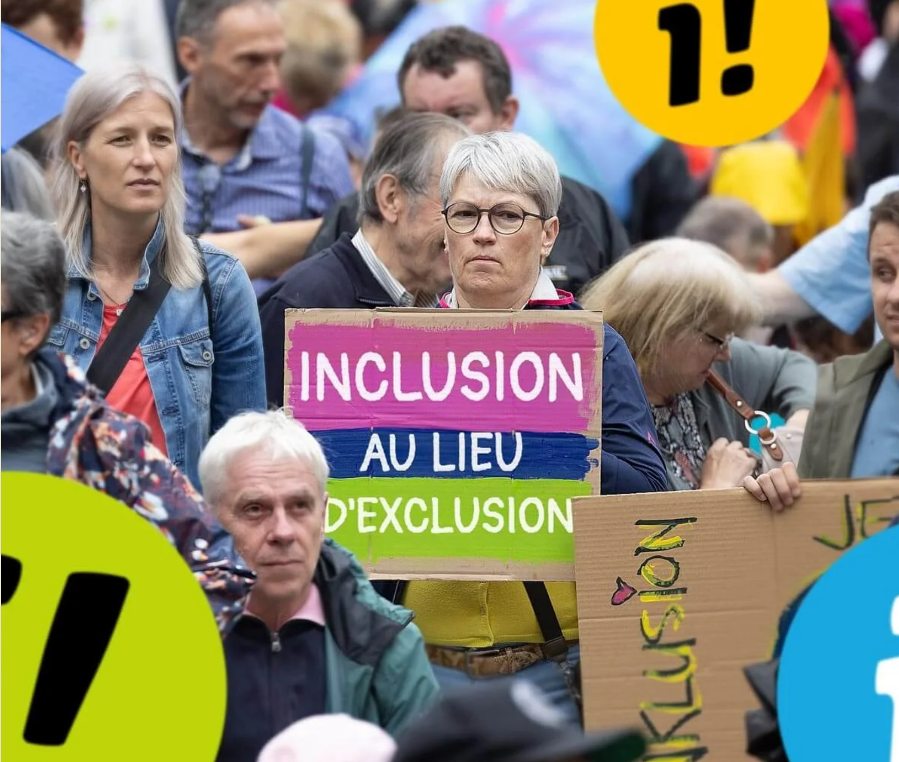

# Réaction du PSGC concernant l’initiative pour l’inclusion 

Déposée à l’automne 2024, avec près de 108'000 signatures, l’initiative exige pour les personnes en situation de handicap une égalité en droit et dans les faits, une participation et une autodétermination, une accessibilité des transports publics sans entraves et un exercice des droits politiques, entre autres.

Le Conseil fédéral a mis en consultation un contre-projet indirect à l’initiative, procédure qui s’est terminée le 16 octobre dernier. 

Le contre-projet est jugé insuffisant par les partisans de l’initiative, qui l’estiment largement en-deçà des attentes des 1,9 million de personnes en situation de handicap. En effet, près de 75% des personnes concernées sont exclues de la loi proposée, signant ainsi un manque d’ambition et l’absence d’un plan réel pour une Suisse inclusive.

Le PS suisse apporte son soutien complet à l’initiative et porte un regard critique sur le contre-projet. Le PLR ainsi que le Centre apportent un soutien critique à l’initiative ainsi qu’au contre-projet. Quant à l’UDC, elle exprime son opposition à l’initiative.

Le PS Grand Chasseral est désagréablement surpris par la position de l’UDC bernoise, exprimée notamment par la voix de son président lors d’une récente émission de La Matinale sur la RTS, qui ne voit pas de nécessité d’agir, selon le fameux adage « Circulez, il n’y a rien à voir ». 

Le PSGC estime au contraire que l’initiative est une chance à saisir pour améliorer le quotidien de bons nombres de nos concitoyens-nes, en mettant notamment en œuvre la Convention de l’ONU relative aux droits des personnes handicapées. Il engagera toute son énergie pour apporter les changements nécessaires, par exemple pour la mobilité ainsi que pour le droit à un logement et à une vie autonome.

 Le PS Grand Chasseral

Ce texte a été soumis comme courrier de lecteur.

