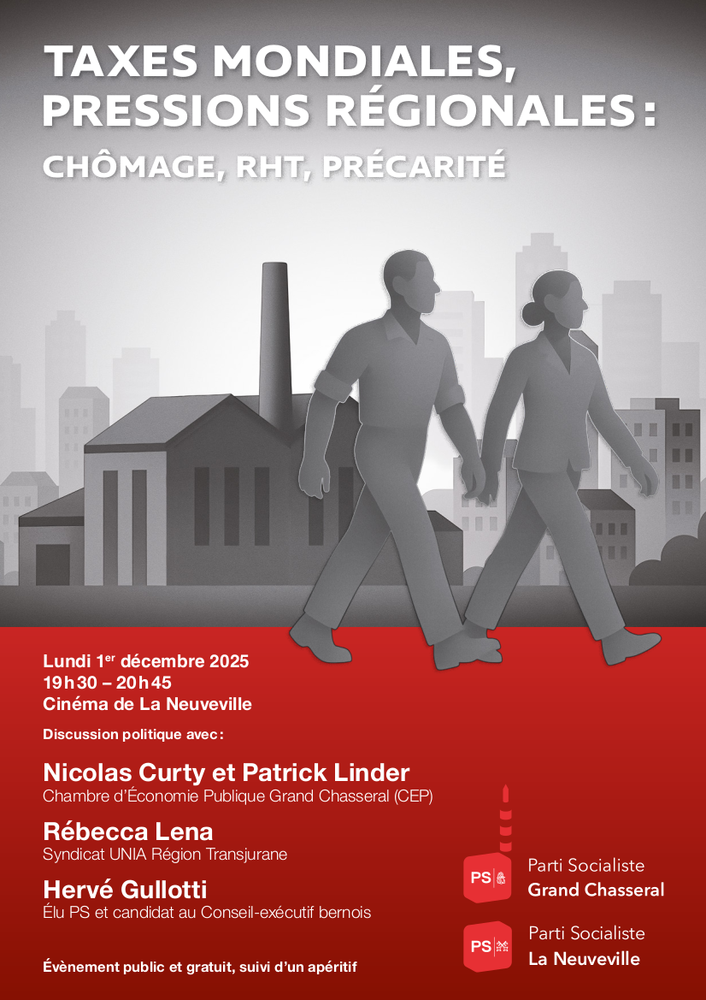

# Le poids des taxes globales, la fragilité régionale : le Jura bernois sous pression

<b> Alors que les grandes décisions fiscales se prennent à l’échelle mondiale, leurs conséquences frappent de plein fouet les réalités locales. Le PS La Neuveville et le PS Grand Chasseral invitent la population à une discussion ouverte sur les défis économiques et sociaux qui touchent le Jura bernois. L’événement, prévu le 1er  décembre 2025, abordera les liens entre taxes globales, emploi et précarité. </b>

Au cours de cette soirée, plusieurs invité·e·s de premier plan apporteront leur regard sur ces enjeux. Nicolas Curty et Patrick Linder, président et directeur de la Chambre d’Économie Publique (CEP) Grand Chasseral, proposeront une analyse économique ancrée dans la réalité régionale. Rébecca Lena, secrétaire générale du syndicat UNIA Transjurane, mettra pour sa part en lumière les conséquences sociales concrètes que subissent les salarié·e·s face aux mutations économiques. Enfin, Hervé Gullotti, maire de Tramelan et candidat PS au Conseil-exécutif bernois, soulèvera les enjeux politiques de cette problématique. La soirée, axée sur les pressions internationales et leurs conséquences sur l’emploi et les conditions de travail régionales, se clôturera par une table ronde et un échange ouvert avec le public. L’événement sera suivi d’un apéritif convivial.

## Toutes et tous concerné·e·s, à différents degrés

Les décisions prises à des milliers de kilomètres de notre région ont des répercussions directes sur nos entreprises, nos salarié·e·s et nos familles. Les taxes américaines et les aléas des échanges commerciaux mondiaux peuvent renforcer l’insécurité de l’emploi et les inégalités sociales, mettant notre région face à des défis économiques et sociaux majeurs. Les socialistes de la région souhaitent ouvrir le débat et réfléchir collectivement à des solutions pragmatiques et solidaires. Comment maintenir des emplois stables, renforcer la cohésion sociale et garantir la dignité de chacun·e dans un monde économique globalisé ?

## Venez nombreux·ses !
Le PS La Neuveville et le PS Grand Chasseral se réjouissent d’accueillir la population à cette rencontre ouverte à toutes et à tous, le lundi 1er  décembre à 19h30 au Cinéma de La Neuveville. L’entrée est libre et l’apéritif offert.

<b> Le parti Socialiste de La Neuveville  et le Parti Socialiste Grand Chasseral</b>

Le flyer au format PDF peut-être téléchargé  <a
      href='/docs/communications/autres/Flyer_taxes_PS_web.pdf'
      target='_blank'
      class='text-blue'>ici</a>.

Le communiqué au format PDF se trouve <a
      href='/docs/communications/2025_11_11_communiqué_soirée_taxes_VF.pdf'
      target='_blank'
      class='text-blue'>ici</a>.

