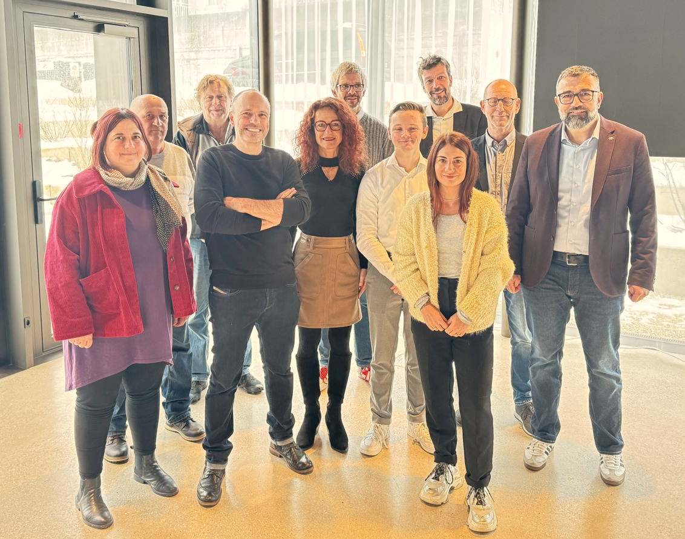

# Élections cantonales 2026 : le PSGC lance sa campagne électorale, sous le signe de l’unité

<b> Le Parti socialiste du Grand Chasseral (PSGC) a détaillé ce matin à La Couronne de Sonceboz, devant la presse, ses listes, ses objectifs ainsi que ses thèmes de campagne en vue des élections cantonales et régionales bernoises de mars prochain. Fort d’une fusion
réussie, le mouvement se présente désormais en bloc uni, avec une équipe solidement ancrée dans les réalités et spécificités régionales et, surtout, une ambition affichée et claire, à savoir transformer cette cohésion interne en force électorale. </b>

## Une seule voix pour le Grand Chasseral
Il y a quatre ans, les forces socialistes se présentaient en ordre dispersé. Aujourd'hui, le paysage a
changé. À la suite de la fusion entre le Parti socialiste du Jura bernois et Ensemble Socialiste, et
après le départ de Moutier, une seule voix s'exprime désormais, celle du Parti socialiste du Grand
Chasseral (PSGC). « Nous avons promis la clarté, nous y sommes » a ainsi déclaré Jean Luc
Berberat lors de la conférence de presse. Cette union n'est pas qu'organisationnelle : elle est déjà
effective au Grand Conseil et au Conseil du Jura bernois (CJB), où les représentantes et
représentants socialistes siègent ensemble depuis quelques mois.

## Des listes représentatives avec des candidat-e-s chevronné-e-s
Le PSGC propose 24 candidatures d’une grande diversité, alliant des profils chevronnés (piliers
d’expérience au Grand Conseil et au CJB) à de nouveaux talents issus de la société civile. En
termes de listes, cette unité se décline concrètement en quatre listes (deux pour le Grand Conseil et
deux pour le CJB) respectant une parité stricte avec 12 candidates et 12 candidats.
Ces listes reflètent la richesse du Jura bernois, réunissant des professionnels de la santé, de
l’enseignement, de l’industrie et des services publics. Ce sont des candidat-e-s engagé-e-s dans le
tissu associatif, prêt-e-s à porter les dossiers à Berne avec une légitimité renforcée

## Un objectif ambitieux : une progression nette dans la stabilité
Actuellement, le parti occupe quatre sièges au Grand Conseil et sept au Conseil du Jura bernois.
L'objectif pour 2026 est le statu quo, une ambition qui se veut en réalité très forte. « Le départ de
Moutier, qui représentait un ancrage socialiste fort, change la donne, d’autant plus que nous
bénéficions actuellement de trois sièges supplémentaires qui étaient occupés par des Prévôtois·es
jusqu’en automne dernier » a précisé le parti. Maintenir ces positions sans l'apport électoral de
Moutier représenterait ainsi une progression nette en termes de suffrages par rapport à 2022.

## La défense de la région n’est pas un slogan, mais un engagement
Tout comme ses objectifs, les thèmes de campagne du PSGC sont résolument tournés vers
l’offensive, vers la défense des intérêts de la région, qui sont pluriels. Comme l’a déclaré Jessica
Froidevaux, « défendre la région, c’est défendre les gens qui y vivent ». Or, ces derniers ont besoin
d’un parti qui s’engage pour le développement régional, qui passe par le maintien et le renforcement
des infrastructures, pour une vie culturelle riche et des offres sportives variées ainsi que pour offrir
aux entreprises locales et régionales, à travers le levier d’attractivité et d’innovation puissant qu’est
la formation, les compétences dont elles ont besoin pour être compétitives.
La préservation de l’emploi, la protection du pouvoir d’achat et le soutien aux PME du Jura bernois
constituent un autre point fort du programme électoral du PSGC, comme l’a expliqué Thierry
Gagnebin, insistant sur le fait que, quand l’activité diminue, ce sont les familles et leur pouvoir
d’achat qui sont impactés. Or, « protéger le pouvoir d’achat, c’est préserver les emplois, soutenir
nos PME et maintenir la vitalité des commerces locaux, essentiels au dynamisme de nos villages ».
La question de la santé publique et de l’accès aux soins se retrouve bien évidemment aussi au
cœur des préoccupation du PSGC. Notre objectif en la matière est de nous engager et de lutter
pour garantir un accès à des soins de base et de proximité à toute la population. « La Suisse
dispose d’un système de santé de haute qualité, mais la hausse structurelle des coûts (3 à 4% par
an) se répercute directement sur les primes d’assurance-maladie, qui pèsent de plus en plus
lourdement sur les ménages et menacent l’accès aux soins » a ainsi déclaré Sandra Roulet. Pour y
remédier, nous voulons notamment réduire les primes, renforcer la prévention, mieux piloter le
système de santé et lutter contre la pénurie de médecins, psychologues et personnel soignant.

## La gauche est là, et elle est prête
S’inscrivant dans la droite ligne des thèmes et objectifs de campagne évoqués par ses préopinants,
le candidat du PSGC à l’exécutif cantonal, Hervé Gullotti, a pour sa part dit toute sa fierté de voir
une gauche unie pour l’élection au Conseil-exécutif, rappelant au passage que, dans un contexte
politique où les forces conservatrices et bourgeoises cherchent à replier, notre unité est une force. Il
a par ailleurs insisté sur le caractère décisif de cette élection : « Elle est décisive parce qu’elle
oppose deux visions de la société. D’un côté, une vision bourgeoise, libérale, qui met en avant la
responsabilité individuelle comme réponse quasi unique à tous les problèmes. » […] De l’autre,
« Une vision fondée sur la solidarité. Une vision qui reconnaît que les parcours de vie ne sont pas
égaux, que les chances ne sont pas réparties équitablement, et que le rôle de l’État est justement
de corriger ces inégalités, et non de les aggraver ». C’est notamment ce sur quoi nous allons nous
engager, ce pour quoi nous allons nous battre.

## Le cœur de notre campagne, c’est le terrain
Pour cette campagne, le PSGC a par ailleurs fait un choix clair, celui de mener une campagne
proche des gens, visible sur le terrain et cohérente dans ses messages, alliant présence physique
et outils numériques. Cette stratégie repose sur une donnée simple : pour convaincre, il faut être là
où vivent les citoyennes et les citoyens, écouter leurs préoccupations et y répondre de manière
concrète. Raison pour laquelle, comme l’a rappelé Noah Mollard lors de la conférence de presse,
nous serons présents dans les plus grandes communes du Grand Chasseral, avec des stands, sur
les marchés et dans les lieux de passage. Ces moments sont en effet essentiels, parce qu’ils
permettent justement le contact direct avec la population et les échanges avec elle.

<b> Le PSGC </b>

Le dossier presse en fichier pdf est disponible  <a
      href='/docs/communications/26_01_16_CP_Dossier_presse_PSGC.pdf'
      target='_blank'
      class='text-blue'>ici</a>. 

## Viens soutenir notre campgane! 
Nous avons maintenant besoin de toi! Pour réussir cette campagne, nous avons besoin de la mobilisation de nos membres et sympathisants,et de soutien financier.

Viens nous aider et participe à nos actions de stands et téléphones pour mobiliser la population à voter! Inscris-toi sur <a
      href='https://framaforms.org/elections-cantonales-2026-stands-telephones-ps-grand-chasseral-1762344090'
      target='_blank'
      class='text-blue'> ce formulaire  </a>  
      pour faciliter l’organisation. 

Vos dons et votre générosité sont également importants pour financer nos actions et annonces pour la campagne à venir. Nous nous réjouissons pour tout soutien, que ce soit 10 CHF ou 500 CHF.   
IBAN : CH37 0624 0575 1493 2090 5, 
Parti socialiste du Grand Chasseral, 2610 Saint-Imier 

## Ensemble pour plus de solidarité
Ensemble nous avançons vers un cap clair : défendre la population et la région avec les valeurs fortes du Parti socialiste : solidarité, écologie et égalité.

<b> Le Parti Socialiste Grand Chasseral</b>

