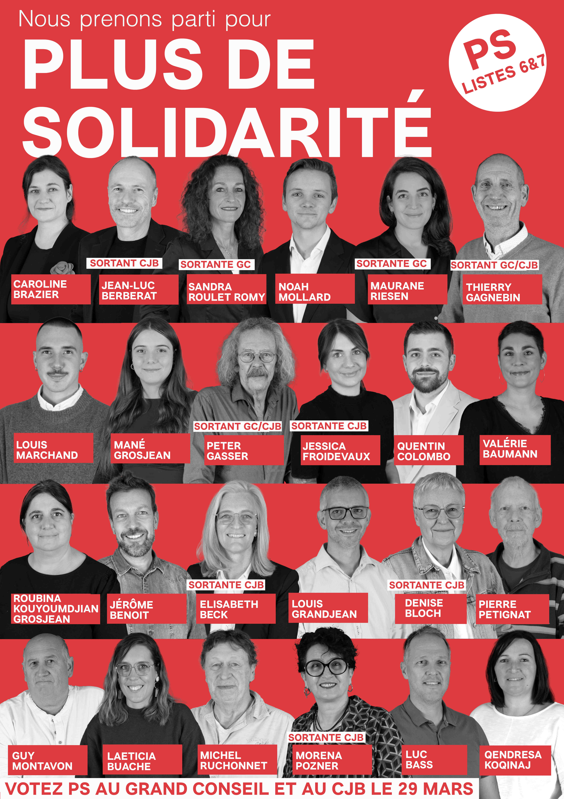

# Le PSGC en campagne

<b> Nos 24 candidates et candidats incarnent la diversité du Jura bernois — par leurs origines, leurs parcours et leurs professions — et veulent porter la région vers plus de solidarité, d'écologie et d'égalité. 
  </b>

## Viens soutenir notre campagne! 
Nous avons maintenant besoin de toi! Pour réussir cette campagne, nous avons besoin de la mobilisation de nos membres et sympathisants, et de soutien financier.
Rejoins-nous lors de l'une de nos actions (voir <a
      href='https://filterdatatable.shinyapps.io/psgc_calendrier/'
      target='_blank'
      class='text-blue'> calendrier  </a>  ). Pour discuter, dire bonjour ou pour nous aider à faire campagne. 

Inscris-toi sur <a
      href='https://framaforms.org/elections-cantonales-2026-stands-telephones-ps-grand-chasseral-1762344090'
      target='_blank'
      class='text-blue'> ce formulaire  </a> pour faciliter l’organisation, ou viens spontanément. 

Vos dons et votre générosité sont également importants pour financer nos actions et annonces pour la campagne à venir. Nous nous réjouissons pour tout soutien, que ce soit 10 CHF ou 500 CHF. 
  
IBAN : CH37 0624 0575 1493 2090 5, 
Parti socialiste du Grand Chasseral, 2610 Saint-Imier 

## Programme électoral

### Nous prenons parti pour une région solidaire

La grande majorité de la population est de plus en plus sous pression. Les coûts augmentent et les salaires stagnent. En même temps, le capital des super-riches continue de croître. Le PSGC se bat contre la croissance de ces inégalités et cette injustice. 

### Nous prenons parti pour la protection de l'environnement

La crise environnementale que nous vivons comprend trois aspects : changement climatique, pollution et perte de la biodiversité. Nous devons tout mettre en œuvre pour qu’un avenir viable puisse être garanti aux générations futures sur cette planète, en faisant notre part dans notre canton. 

### Nous prenons parti pour plus d’égalité et d’inclusion

L’égalité entre hommes et femmes devrait être une évidence mais est encore loin d’être une réalité. Il existe toujours un écart salarial et une sous-représentation politique et dans les instances dirigeantes des entreprises. Il y a toujours trop de violences qui touchent les femmes et les minorités sexuelles. Nous bénéficions tous d’une meilleure intégration des personnes issues de la migration ou en situation de handicap. De plus, l’intégration des spécificité de notre région francophone est un enrichissement pour tout le canton de Berne. 

<b> Retrouve notre programme électoral complet avec les thèmes qui nous tiennent à coeur  <a
      href='/docs/communications/autres/Programme_électoral_PSGC_2026_v2.pdf'
      target='_blank'
      class='text-blue'>ici</a>. </b>

## Ensemble pour plus de solidarité
Ensemble nous avançons vers un cap clair : défendre la population et la région avec les valeurs fortes du Parti socialiste : solidarité, écologie et égalité.

<b> Le Parti Socialiste Grand Chasseral</b>

