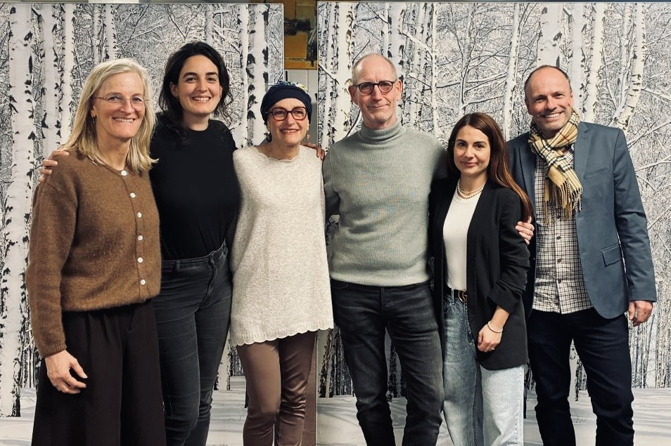

# Un premier test réussi pour le PSGC

<b> Le Parti Socialiste Grand Chasseral (PSGC) deuxième force politique de la région! Le PSGC sort renforcé de ces élections. Avec l'élection de trois personnes au Grand Conseil et cinq au Conseil du Jura bernois (CJB), il se positionne clairement comme le parti progressiste du Jura bernois. L'excellent résultat de son candidat au gouvernement Hervé Gullotti montre qu'ensemble, la gauche réussit. 
  </b>

## Un excellent score pour Hervé Gullotti
Le candidat du PSGC pour le gouvernement a réussi un très bon résultat avec 87'956 voix.
Il a porté haut la voix du Jura bernois dans tout le canton et a montré qu'un retour d'une majorité de gauche au gouvernement est un objectif atteignable, même si pour cette fois il a manqué de peu pour y arriver. C'est de bon augure pour l'après-Schnegg. Il arrive ainsi au terme d'une campagne extrêmement positive et engagée, qui a permis de tirer la gauche vers le haut dans tout le canton. 

## Trois députés expérimentés au Grand Conseil
L'élection de Maurane Riesen, Sandra Roulet et Thierry Gagnebin au Grand Conseil permet au PSGC de continuer d'être représenté par des personnes expérimentées et engagées pour la région et la population. La non-réélection de Peter Gasser au Grand Conseil,  qui a fait son retour au Grand Conseil fin 2025 en reprenant le siège laissé vacant par le PSA-Moutier, est douloureuse, mais elle ne signifie pas une perte de l'électorat. Le PSGC le remercie pour son travail au Grand Conseil.

## Maintien au Conseil du Jura bernois
Au CJB, le PSGC peut compter sur 5 représentant-e-s: Elisabeth Beck, Sandra Roulet, Thierry Gagnebin, Jean-Luc Berberat et Jessica Froidevaux (Maurane Riesen ayant décidé de ne pas siéger pour mettre la priorité sur le Grand Conseil). Le parti maintient également son électorat et part sur une base unie et prometteuse pour cette nouvelle législature.
Le PSGC remercie les sortant-e-s Peter Gasser, Morena Pozner et Denise Bloch pour leur travail et leur engagement au CJB. 

## Une campagne dynamique et solidaire
Le PSGC, moins de deux ans après sa création suite à une fusion historique, peut se féliciter d'avoir réussi son pari.  Il remercie toutes les personnes qui l'ont soutenu. Il a permis la réelection de trois sortant-e-s au Grand Conseil et cinq au CJB. Il a fait une campagne dynamique, unie et solidaire et a montré qu'ensemble, nous sommes plus forts, ensemble nous pouvons changer les choses et nous engager pour une région tournée vers l'avenir.

<b> Le Parti Socialiste Grand Chasseral</b>

<b> Notre communiqué au format PDF se trouve  <a
      href='/docs/communications/2026_03_29_communiqué_psgc_elections.pdf'
      target='_blank'
      class='text-blue'>ici</a>. </b>

