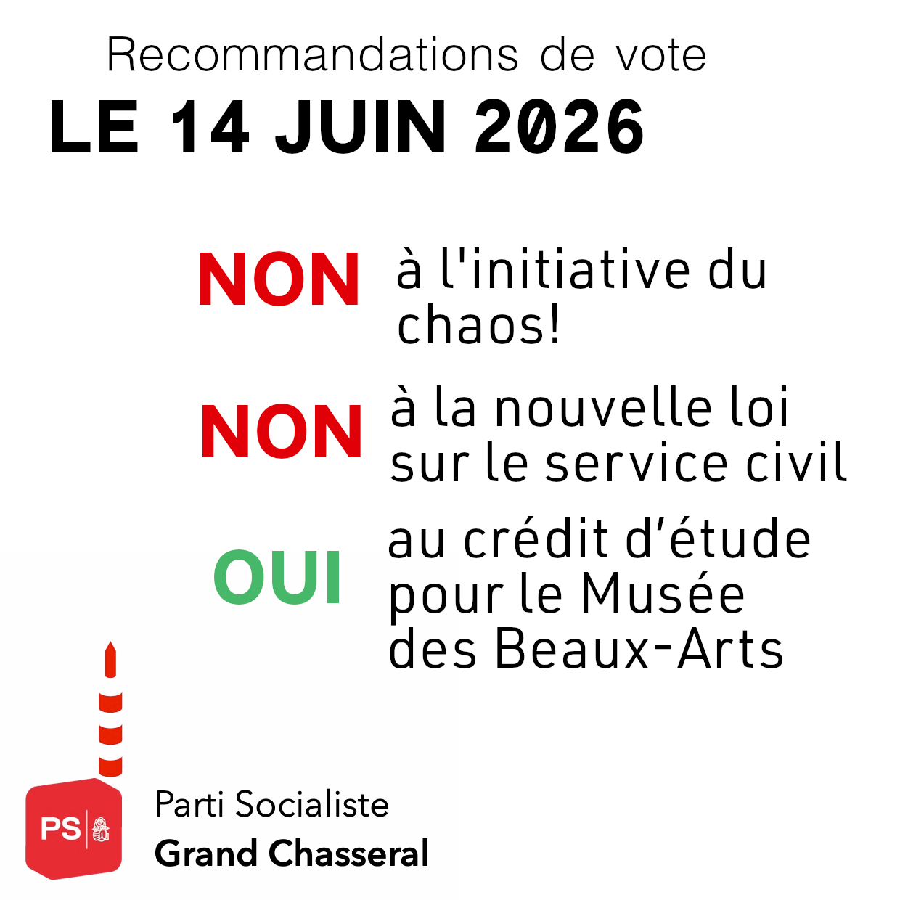

# Deux NON et un OUI le 14 juin

<b> NON à l'initiative du chaos, NON à la nouvelle loi sur le service civil et un OUI responsable et solidaire au projet Eiger.
  </b>

## Non à l'initiative du Chaos!
Cette initiative est extrêmement dangereuse. Elle menace notre économie, notre système de santé, notre AVS, notre liberté de voyager et notre cohésion. Elle aurait comme conséquence une crise économique massive dont la population ferait les frais. 

Chômage, baisse du pouvoir d'achat, pénurie de main d’œuvre sont autant de conséquences sans que l'initiative ne puisse régler aucun problème. Pour faire face à la pénurie de logement, il faut densifier les zones construites avec des logements abordables et limiter les constructions de maisons individuelles et de résidences secondaires. Pour favoriser la biodiversité et la nature, il faut des plans directeurs solides et des zones de protection. Pour aider les écoles il faut plus de moyens, de personnel et de locaux. Pour contrer la pénurie de main d’œuvre, il faut de meilleures conditions de travail et salaires ! Voilà tant de démarches que le PS pousse activement, souvent sans succès car les majorités de droite  préfèrent augmenter toujours plus les retours sur investissement des riches. 

L'immigration a toujours été un facteur de développement de notre pays, notre génération ne peut imposer ni décider à la place des générations futures. De plus, l'immigration légale que l'UDC veut limiter serait compensée par une immigration illégale et non déclarée. Le résultat du Brexit l'a montré, ce genre de décision ne change pas les flux mais la nature de la migration.

Finalement, l'initiative du Chaos est prête à remettre en cause les Conventions internationales, dont celle de l'ONU relative aux droits de l'enfant. Les droits humains, les droits des enfants ne sont pas négociables! 

Cette initiative populiste et autopublicitaire est une honte de la part d'un parti qui pourtant a des fonctions gouvernementales aux plus hauts niveaux.

## Non à la nouvelle loi sur le service civil!
Cette modification de la loi est inutile et néfaste. Elle affaiblira le service civil et donc les domaines clés qui en bénéficient et qui sont déjà fortement sous pression comme les hôpitaux, les EMS ou les écoles. Elle dévalorise un service rendu à la collectivité qui est pourtant fondamental et mérite d'être encouragé et non découragé.

La sécurité de la Suisse n'est pas uniquement garantie par l'armée, elle l'est également, voire surtout, par la sécurité sociale, sanitaire et environnementale, domaines dans lesquels le service civil  a prouvé sa nécessité ces dernières années.

Plutôt que d'opposer les formes de service à la société, il faut reconnaître leur complémentarité. Une politique responsable doit miser sur une sécurité globale, humaine et durable, qui valorise l'engagement au service de la collectivité et répond aux défis concrets auxquels la population est confrontée aujourd'hui.

## Pour un OUI responsable et solidaire au projet Eiger
Pour nous, la culture est un service public. Elle doit être accessible à toutes et tous, pas réservée à une minorité. Mais soutenir la culture ne signifie pas dépenser sans compter. Aujourd’hui, le Musée des beaux-arts de Berne se trouve dans un état qui ne répond plus aux exigences minimales de sécurité, d’accessibilité et de protection des œuvres. Continuer à repousser les décisions, c’est prendre des risques inutiles et, à terme, faire payer plus cher la population.

Le projet « Eiger » n’est pas un projet de prestige. Il est le résultat d’une démarche sérieuse, fondée sur une étude de faisabilité et un concours d’architecture international. Il propose plus qu’une simple rénovation : la remise à niveau du bâtiment historique Stettler, la construction d’un bâtiment de remplacement fonctionnel et durable, et l’intégration de l’immeuble de la Hodlerstrasse. Ce dernier accueillera notamment un bistro ouvert au public, renforçant l’ancrage du musée dans la vie quotidienne des habitantes et habitants.

Avec le projet Eiger, le musée devient plus ouvert, plus accessible et plus utile à la société : accès sans obstacles, davantage de place pour la médiation culturelle, meilleures conditions pour les publics scolaires, locaux polyvalents et espaces publics librement accessibles au bord de l’Aar et sur la Hodlerstrasse. C’est une vision de la culture proche du peuple, ancrée dans l’espace urbain et tournée vers l’avenir.

Le crédit soumis au vote le 14 juin ne finance pas les travaux, mais une étude de projet strictement encadrée, d’un montant de 15,7 millions de francs. Cette étape est indispensable pour garantir des coûts maîtrisés et une transparence totale. La part du canton est clairement plafonnée à 81 millions de francs, et une part importante du financement repose sur des contributions privées. C’est un partenariat équilibré, qui protège l’argent public tout en permettant un projet de qualité.

Refuser ce crédit ne serait ni social ni responsable. Le musée devrait malgré tout être rénové, mais sans les contributions privées, qui seraient définitivement perdues, et avec au final plus de charge pour la collectivité. Dire oui, c’est faire un choix de bon sens : investir intelligemment aujourd’hui pour éviter des coûts plus élevés demain, garantir l’accès à la culture pour toutes et tous et préserver un patrimoine commun.

<b> Un OUI, c’est un OUI à une culture forte, accessible et socialement responsable.
  </b>

<b> Le Parti Socialiste Grand Chasseral</b>

<b> Nos recommandations au format PDF se trouve  <a
      href='/docs/communications/2026_05_08_recommvotes_psgc_juin26.pdf'
      target='_blank'
      class='text-blue'>ici</a>. </b>

D'ailleurs, pour lutter contre la désinformation, on s'est permis de rectifier un peu le tout-ménage ignoble de l'UDC:

