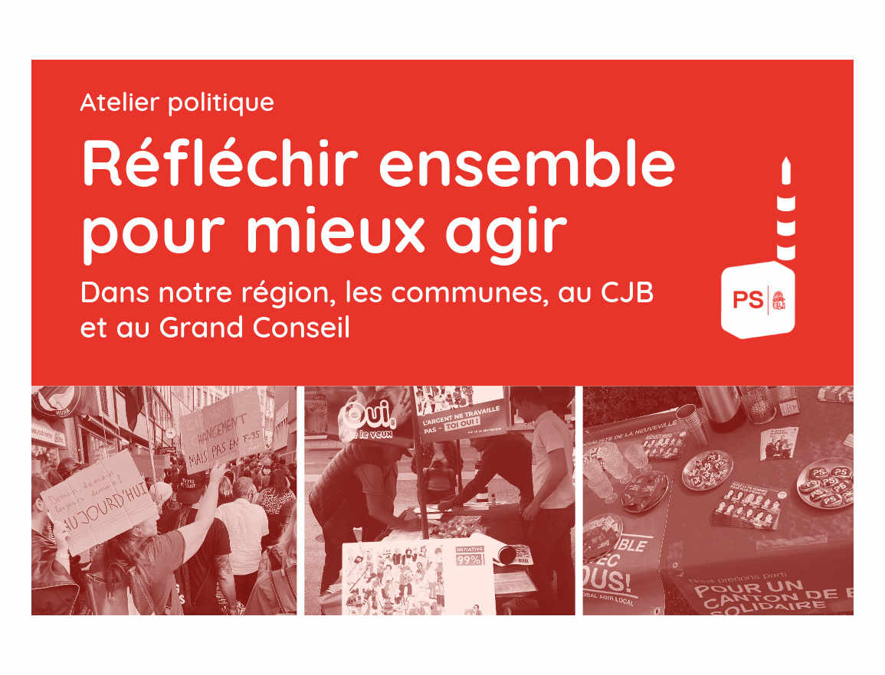

# Réfléchir ensemble pour mieux agir

<b> Le PS Grand Chasseral, ce sont ses membres, ses sympathisant·e·s et toutes les personnes qui ont envie de s'engager avec nous pour la région. Pour préparer la suite, nous voulons t'entendre : quelles priorités défendre dans la région, nos communes, au CJB et au Grand Conseil? Et comment mieux travailler ensemble pour y parvenir ?
  </b>

Nous t'invitons à un atelier participatif le <b> dimanche 25 octobre, à l'Hôtel de l'Ours, La Chaîne 6, 2515 Prêles.</b>

09h00 Café et arrivée 
09h30 Accueil et mot de bienvenue 
09h45 Trois ateliers : nos thèmes et priorités  ; visibilité, communication et événements ; lien entre le parti et les sections 
10h45 Pause 
11h00 Mise en commun en plénum 
11h30 Prochaines étapes et groupes de travail 
12h00 Brunch ensemble au restaurant de l’Ours 

L'atelier est gratuit. Le brunch est à la charge de chacun·e, amis et famille sont bienvenus pour nous y rejoindre.

<b> Inscris‑toi d'ici le 16 octobre : <a
      href='https://framaforms.org/inscription-atelier-psgc-du-25-octobre-1790534305'
      target='_blank'
      class='text-blue'>LIEN INSCRIPTION</a>. </b>

Le flyer au format PDF se trouve  <a
      href='/docs/communications/atelier-psgc-flyer-A4-1.pdf'
      target='_blank'
      class='text-blue'>ici</a>. </b>

